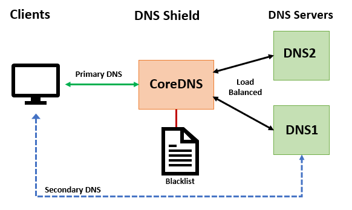
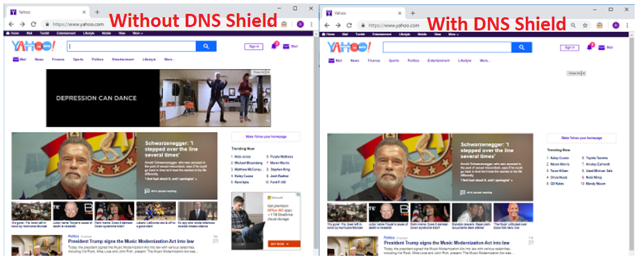

# **DNS Shield** 

**A simple DNS firewall to block ads, tracking and malware.**

This is a simple system that uses the excellent [CoreDNS](https://coredns.io/) DNS server, a composite [blacklist](https://github.com/StevenBlack/hosts) and CoreDNS's proxy capabilities to block users from ads, tracking, spyware, and malware content (currently blocks over 56K sites). In addition, alternate blacklists can be selected to also block porn, gambling, social media and fake news content. Since this works at the DNS level, it will work with all clients regardless of the OS, platform, browser and without the need for any plugins. The basic architecture is shown in the diagram below.



## Requirements

To install DNS Shield you'll need a Linux server with tcp/udp port 53 open (might need to disable/stop local dnsmasq server to free up port 53). The install script has been tested with Ubuntu 16.04 and 18.04 but it should also work on CentOS 7.x or any other systemd based system.  You'll also need at least one downstream DNS server to proxy requests to (your institution's, or ISP's DNS server(s)).

## Installation

If you are on the Fred Hutch campus network you can use the install script as-is to install DNS Shield with the following command:  

```bash
sudo bash -c "curl -s https://raw.githubusercontent.com/FredHutch/dns-shield/master/dns-shield-install.sh | bash"
```

If you are not on the Fred Hutch campus network you'll need edit the script to include your dns server(s). First download the the installer script and make it executable:

```bash
curl -s https://raw.githubusercontent.com/FredHutch/dns-shield/master/dns-shield-install.sh  > dns-shield-install.sh
chmod +x dns-shield-install.sh
```

Edit the variables section of the script and update the DNS_SERVER1/2 variables. For example below we are going to use the public Google DNS servers:

```bash
# Backend DNS servers to proxy; format "<ip_address>:<port>"
DNS_SERVER1=8.8.8.8:53
DNS_SERVER2=8.8.4.4:53
```

Then execute the script as follows:

```bash
sudo ./dns-shield-install.sh
```

## Testing

To make sure that the service is using the blacklist to block some requests, execute the following command on the server were DNS Shield in installed:

```bash
dig @127.0.0.1 doubleclick.net
```

In the answer section of the output you should see that the query received a non-routable address of "0.0.0.0":

```bind
;; ANSWER SECTION:
doubleclick.net.	3600	IN	A	0.0.0.0
```

Now to make sure that non-blacklisted queries are being proxied to your DNS servers. Execute the following command on the server:

```bash
dig @127.0.0.1 status.fredhutch.org
```

In the output you should see that the query succeeded and you got a vaild IP in the answer section like the following:

```bind
;; ANSWER SECTION:
status.fredhutch.org.	86400	IN	A	52.60.128.125
```

## Client Configuration

Since DNS Shield works at the DNS level all that's required is to adjust the client's DNS settings and putting the IP address of the DNS Shield server as the first DNS server. As a backup the second and possibly third DNS server configured configured should be your standard DNS servers. With this configuration, if the DNS Shield has an outage, clients will bypass it and still resolve queries.

After a client has been configured to use the DNS Shield server as their first DNS server, ads and other unwanted content will simply be missing from rendered websites. Here is an example of the same website first without DNS Shield and then with DNS Shield (notice the extra whitespace).



If you want to rollout DNS Shield to all clients on specific subnets on your entire network you can adjust your DHCP server to automatically configure clients DNS configuration.

## Blacklist Updates

The upstream site typically updates the blacklists once a day. The install script created a cron job to check for and apply updates every six hours.

## Blocking Porn, Gambling, Fake News, or Social Media Content

By default DNS Shield is only protecting from ads, tracking and malware sites. If you'd like to add protection from additional types of content such as porn, fake news, gambling or and social media you are configure CoreDNS to use an alternate blacklist. All blacklist contain ads/tracking/malware and are available in the following combinations:

- ads+malware+fakenews:  /etc/coredns/hosts/alternates/fakenews/hosts
- ads+malware+fakenews+gambling: /etc/coredns/hosts/alternates/fakenews-gambling/hosts
- ads+malware+fakenews+gambling+porn: /etc/coredns/hosts/alternates/fakenews-gambling-porn/hosts
- ads+malware+fakenews+gambling+porn + social: /etc/coredns/hosts/alternates/fakenews-gambling-porn-social/hosts
- ads+malware+fakenews+gambling+social: /etc/coredns/hosts/alternates/fakenews-gambling-social/hosts
- ads+malware+fakenews+porn: /etc/coredns/hosts/alternates/fakenews-porn/hosts
- ads+malware+fakenews+porn+social: /etc/coredns/hosts/alternates/fakenews-porn-social/hosts
- ads+malware+fakenews+social: /etc/coredns/hosts/alternates/fakenews-social/hosts
- ads+malware+gambling: /etc/coredns/hosts/alternates//hosts
- ads+malware+gambling+porn: /etc/coredns/hosts/alternates/gambling/hosts
- ads+malware+gambling+porn+social: /etc/coredns/hosts/alternates/gambling-porn-social/hosts
- ads+malware+gambling+social: /etc/coredns/hosts/alternates/gambling-social/hosts
- ads+malware+porn: /etc/coredns/hosts/alternates/porn/hosts
- ads+malware+porn+social: /etc/coredns/hosts/alternates/porn-social/hosts
- ads+malware+social: /etc/coredns/hosts/alternates/social/hosts

To use a different blacklist, edit the CoreDNS configuration file (/etc/coredns/Corefile) and edit the "hosts" line to point to the correct hosts file. For example here we are adding porn content filtering:

```bind
.:53 {
    prometheus 0.0.0.0:9153
    bind 0.0.0.0
    hosts /etc/coredns/hosts/alternates/porn/hosts {
      fallthrough
    }
    proxy . 140.107.42.11:53 140.107.117.11:53
}
```

After making changes to the CoreDNS server you'll need to restart the service.
